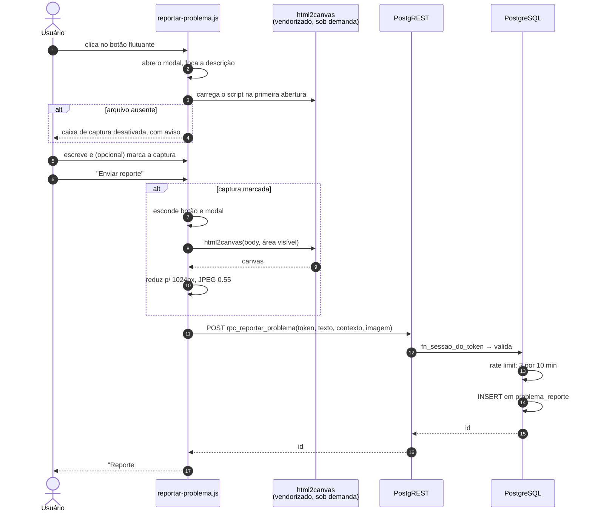

# Reportar problema

Canal de feedback dentro do próprio sistema: um botão flutuante nos três
painéis abre um formulário curto que grava o reporte no banco, com o contexto
técnico da tela e — se o usuário marcar — uma captura da tela atual.

> **Não é chamado de manutenção.** O chamado é sobre um computador do
> laboratório; o reporte é sobre **o DSos**: um botão que não responde, uma
> tela confusa, um erro de sistema.

## Estado

| Peça | Situação |
|---|---|
| Migration `20260829120000_reportar_problema.sql` | **aplicada no banco de TESTE** em 2026-08-29 e validada; produção pendente de aprovação |
| `js/reportar-problema.js` + `css/reportar-problema.css` | prontos e integrados aos três painéis |
| `js/vendor/html2canvas.min.js` | vendorizado (1.4.1, MIT, 194 KB) e testado ponta a ponta |
| Tela de triagem no painel T.I. | não feita — fase 2 |

## Arquivos

```
supabase/migrations/20260829120000_reportar_problema.sql   tabela + 3 RPCs + RLS
js/reportar-problema.js                                    módulo (injeta botão e modal)
css/reportar-problema.css                                  estilos, prefixados .dsos-rp-
js/vendor/html2canvas.min.js                               1.4.1 MIT, usado na captura
```

Integração — uma linha em cada painel (`painel-pc.js`, `painel-ti.js`,
`painel-logs.js`), logo após `initSessionGuard`:

```js
initReportarProblema();
```

Mais o `<link>` do CSS em cada HTML. Nenhum painel precisou de markup novo: o
módulo injeta o botão e o modal por conta própria. São três telas com
estruturas muito diferentes, e replicar o bloco em cada uma garantiria que uma
delas ficasse para trás na primeira alteração.

## Como funciona



### O que é coletado, e por quê

| Campo | Origem | Aparece na tela antes do envio |
|---|---|---|
| `descricao` | o que o usuário escreveu | sim, é o campo |
| `url` | `location.pathname + search` | sim |
| `viewport` | `innerWidth x innerHeight` | sim |
| `user_agent` | `navigator.userAgent` | sim, truncado |
| `versao_app` | constante do módulo | sim |
| `papel`, `usuario_id`, `usuario_login`, `usuario_nome` | **da sessão validada no banco** | sim, declarado no texto |
| `screenshot` | html2canvas, opt-in | sim, com aviso de privacidade |

A regra que orientou o desenho: **nada é coletado sem estar escrito na tela.**
O bloco "Enviado junto, automaticamente" é expansível justamente para caber
tudo sem assustar quem só quer reclamar de um botão.

Identidade vem sempre da sessão, nunca do corpo da requisição — se viesse do
cliente, qualquer pessoa reportaria em nome de outra. É o mesmo princípio do
SEC-05 (ver [regras-de-acesso, seção 4](regras-de-acesso.md#4-fronteiras-de-confiança)).

### Privacidade da captura

A caixa **vem desmarcada** e o aviso está ao lado dela: a imagem pode conter
dados de outra pessoa que esteja visível naquele momento — um chamado aberto,
um nome numa lista. Nunca inverta esse padrão sem revisar a
[política de privacidade](../html/politica-privacidade.html).

A captura pega **só a área visível**, não a página rolada inteira. No painel
T.I. isso importa: a página inteira traria listas de chamados que o técnico
não precisa arquivar num reporte.

## Segurança

Segue o padrão do projeto — leitura por RLS, escrita por RPC:

| Ação | Quem | Como |
|---|---|---|
| `INSERT` | qualquer sessão válida | `rpc_reportar_problema` (`SECURITY DEFINER`) |
| `SELECT` | só T.I. | policy `problema_reporte_select`: `fn_sessao_tipo() = 'ti'` |
| `UPDATE` (triagem) | só T.I. | `rpc_reporte_status` |
| `DELETE` | ninguém | sem policy |

Não há policy de `INSERT`, `UPDATE` nem `DELETE` — a RLS nega por padrão e a
RPC, que roda como dona, é o caminho único e verificado.

O `REVOKE ALL` no início da migration **não é redundante**: o schema `public`
tem *default privileges* que concedem acesso amplo a `anon` em toda tabela
nova (confirmado via `pg_default_acl` na migration `20260823120100`).

Rate limit: **3 reportes por 10 minutos**, contados pelo par
(`papel`, `usuario_id`) e não pelo token — o token muda a cada login, e contar
por ele deixaria o limite ser zerado por um logout/login.

`rpc_reportes_listar` é `SECURITY INVOKER` **de propósito**: assim a policy de
SELECT continua valendo dentro dela. Uma RPC `SECURITY DEFINER` ali reabriria
exatamente o vazamento que `tests/leitura.test.js` pegou em
`rpc_nao_lidas_por_ticket`.

## Por que a captura ficou na tabela, e não num bucket

O plano original previa um bucket privado `reportes`. **Não dá**, com a
arquitetura de autorização atual — e o motivo é o mesmo que derrubou o Realtime
no SEC-05b:

> A autorização do DSos viaja no header HTTP `X-Sessao-Token`, e só o
> PostgREST o expõe (em `request.headers`). A API de Storage é outro serviço:
> avalia a RLS de `storage.objects` sem esse header, então `fn_sessao_tipo()`
> devolve `NULL` ali dentro. Uma policy de SELECT no bucket só poderia ser
> `bucket_id = 'reportes'` — ou seja, aberta a qualquer um com a `anon key`,
> que é pública.

Ou seja: o bucket "privado" acabaria com a mesma exposição do
[bucket `chat-prints`](regras-de-acesso.md#l3--bucket-chat-prints-é-público),
que já é uma lacuna conhecida. Justamente o que a captura de tela precisa
evitar.

As três saídas eram:

1. **Edge Function com service key** que valida o token e devolve URL assinada
   — funciona, mas cria função nova, secret novo e um deploy à parte;
2. **guardar a imagem na tabela**, herdando a mesma RLS do reporte;
3. **desistir da captura**.

Escolhida a **2**: é a única que protege a imagem com a mesma regra que
protege o texto, sem infraestrutura nova. O custo é espaço na tabela, contido
por três limites — o cliente reduz para 1024px de largura e grava JPEG de
qualidade 0.55; a RPC recusa qualquer coisa acima de 1,2 MB e valida o
prefixo do data URI. Na prática, 120–300 KB por captura.

Se o volume incomodar, migrar para a opção 1 é aditivo: basta passar a gravar
o path em vez do conteúdo.

## Como aplicar

Siga o [WORKFLOW.md](../WORKFLOW.md) — teste antes de produção:

1. ~~Aplicar a migration no banco de TESTE.~~ **Feito em 2026-08-29** — ver [Validação já executada](#validação-já-executada).
2. Apontar os JS para `./supabase-config.test.js` e validar no navegador:
   abrir o modal, enviar um reporte, conferir a linha no banco.
3. Repetir a validação por REST comentada no fim da migration — o caminho HTTP
   real, que a validação abaixo simulou em SQL.
4. Aprovação.
5. Aplicar em **PRODUÇÃO** e reverter os imports.

### Validação já executada

Rodada no banco de TESTE em 2026-08-29, com tokens descartáveis e
`SET ROLE anon` + `set_config('request.headers', ...)` para reproduzir o que o
PostgREST faz. **Todas as linhas de teste foram apagadas depois.**

| Caso | Esperado | Resultado |
|---|---|---|
| RPC sem token | recusa | `sessao ausente` |
| RPC com token forjado | recusa | `sessao invalida ou expirada` |
| Descrição com menos de 5 caracteres | recusa | mensagem de validação |
| Screenshot fora do formato data URI | recusa | `formato de captura invalido` |
| Aluno tenta triar um reporte | recusa | `apenas T.I. pode triar reportes` |
| `INSERT` direto como `anon` | recusa | `permission denied for table problema_reporte` |
| `SELECT` como `anon` **sem** token | 0 linhas | 0 |
| `SELECT` como `anon` com token de **aluno** | 0 linhas | 0 |
| `SELECT` como `anon` com token de **T.I.** | vê tudo | 4 linhas |
| `rpc_reportes_listar` sem token / com token de aluno | 0 linhas | 0 (confirma o `SECURITY INVOKER`) |
| 4º reporte em 10 min | recusa | mensagem de rate limit |
| Reporte de **outro** usuário na mesma janela | aceita | aceitou (limite é por usuário) |
| Identidade gravada | vem da sessão | `papel`, `usuario_id`, `usuario_login` e `usuario_nome` corretos |
| Triagem pelo T.I. | grava status, nota, autor e data | correto |

Advisors de segurança do Supabase depois da migration: nenhum achado novo de
classe nova. `problema_reporte` e as duas RPCs `SECURITY DEFINER` aparecem nos
mesmos avisos genéricos que já valem para as outras 27 tabelas e 73 funções do
projeto — são inerentes ao padrão SEC-05, em que a RPC validada por token é
propositalmente executável por `anon`. `rpc_reportes_listar` **não** aparece
na lista, o que confirma que ficou como `SECURITY INVOKER`.

### html2canvas

`js/vendor/html2canvas.min.js` — versão 1.4.1, licença MIT, 194 KB — já está
vendorizado. Vendorizado, e não de CDN, porque a CSP do `netlify.toml` permite
script de `'self'`: **não foi preciso mexer na política.** A biblioteca gera
`data:` URIs, cobertos por `img-src 'self' data: blob: https:`.

Se o arquivo for removido, a caixa de captura volta a aparecer desativada com
aviso e o reporte de texto continua funcionando — não é erro, é degradação
prevista.

Medido no navegador: uma tela de 1100x700 vira JPEG de 1024px de largura com
cerca de 14 KB — bem abaixo do teto de 1,2 MB imposto pela RPC.

Limitação conhecida da biblioteca: ela **não** captura conteúdo de `<canvas>`
WebGL nem vídeo de câmera com fidelidade. Nas telas do DSos isso afeta apenas
os fundos animados dos easter eggs do painel T.I.

## Fase 2 — triagem no painel T.I.

A migration já entrega o backend da tela:

```js
// lista sem a imagem (campo pesado)
POST /rest/v1/rpc/rpc_reportes_listar  { p_status: 'novo', p_limite: 50 }

// a imagem, só do reporte aberto
GET  /rest/v1/problema_reporte?id=eq.42&select=screenshot

// triagem
POST /rest/v1/rpc/rpc_reporte_status   { p_token, p_id: 42, p_status: 'resolvido', p_nota: '...' }
```

Status possíveis: `novo`, `em_analise`, `resolvido`, `descartado`.

## Documentos relacionados

* [regras-de-acesso.md](regras-de-acesso.md) — o modelo de autorização que este recurso segue
* [../html/politica-privacidade.html](../html/politica-privacidade.html) — o que é declarado ao usuário
* [../WORKFLOW.md](../WORKFLOW.md) — fluxo obrigatório de mudança de banco
