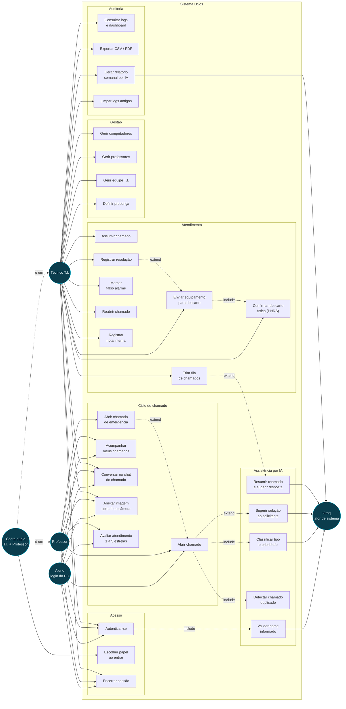

# 01 — Diagrama de casos de uso

**Fonte:** `README.md` (funcionalidades), `html/painel-pc.html`,
`html/painel-ti.html`, `html/painel-logs.html`, `js/painel-*.js`,
`docs/regras-de-acesso.md`.

Atores são **papéis**, não pessoas. A conta dupla T.I.+Professor é uma pessoa
que assume dois papéis — por isso aparece herdando dos dois.

## Leitura do diagrama

### O que cada ator pode fazer

| Ator | Escopo |
|---|---|
| **Aluno (PC)** | Abre chamado **para o próprio computador**, acompanha só os chamados em que o PC dele é origem ou alvo, conversa no chat e avalia o atendimento. Não abre emergência. |
| **Professor** | Tudo do aluno, **mais** a escolha entre chamado normal e chamado de emergência para outro computador, identificado pela tag. Enxerga os chamados cujo `nome_solicitante` é o nome dele. |
| **Técnico T.I.** | Único que atende, gerencia inventário e pessoas, e acessa auditoria. Enxerga todos os chamados. |
| **Conta dupla** | Escolhe no login em qual painel entrar. Para o banco, continua sendo T.I. nos dois casos (ver [regras-de-acesso, seção 1](../regras-de-acesso.md#1-papéis)). |
| **Groq (IA)** | Ator de sistema, não usuário. Nunca inicia nada: sempre é chamada por um caso de uso, via Edge Function `groq-proxy`. |

### Relações `include` e `extend`

* `Autenticar-se` **include** `Validar nome` — a validação do nome informado
  acontece antes de qualquer tentativa de login, e uma falha da IA não bloqueia
  o acesso (o código assume "nome válido" em caso de erro).
* `Abrir chamado` **include** `Classificar` e `Detectar duplicado` — os dois
  são obrigatórios no caminho feliz. A classificação pode **abortar** a
  abertura, se a IA responder `falso`.
* `Abrir chamado` **extend** `Sugerir solução` — a sugestão só aparece para
  algumas prioridades; em emergência e falso alarme, a IA é instruída a não
  sugerir nada.
* `Descartar` **include** `Confirmar descarte físico` — a fila de descarte só
  fecha quando o técnico registra o meio de descarte, que é o que dá
  rastreabilidade PNRS (Lei 12.305/2010).

### O que o diagrama deixa de fora, de propósito

* **Easter eggs e o minigame Skill Check.** São funcionalidades reais e
  documentadas ([EASTER_EGGS.md](../../EASTER_EGGS.md)), mas não são caso de uso
  do domínio — não existe objetivo de negócio por trás.
* **Modo Hacker e tema claro/escuro.** Preferência de exibição, não caso de uso.
* **Anônimo.** Não é ator: não existe caso de uso destinado a quem não fez
  login. O que um anônimo *consegue* fazer apesar disso está catalogado como
  lacuna em [regras-de-acesso, seção 5](../regras-de-acesso.md#5-lacunas-conhecidas-e-risco-residual).
