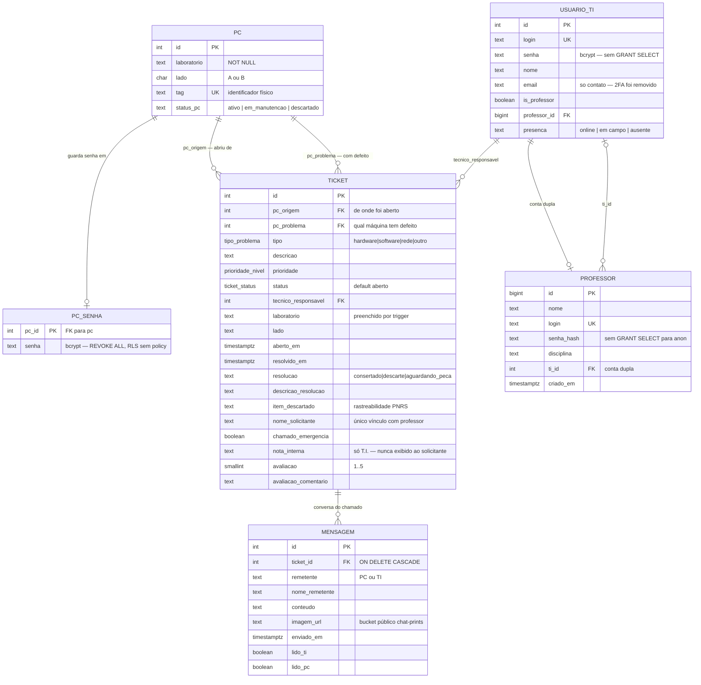
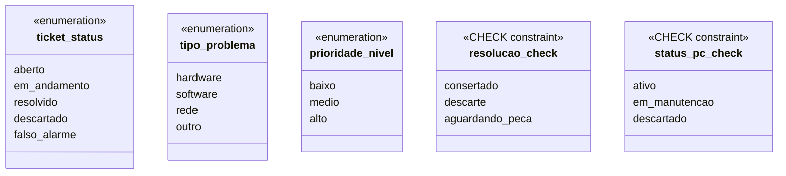

# 02 — Diagrama de entidades

**Fonte:** `supabase/migrations/20260101000000_baseline_schema.sql` (tabelas,
constraints, FKs) + `20260823120100_mover_pc_senha_para_tabela_separada.sql`
+ `20260823150000_sec05_infra_token_sessao.sql`
+ `20260828120000_realtime_sinal_recupera_ao_vivo.sql`.

Tipos e nomes de coluna são os do banco, sem tradução.

## 2.1 Núcleo do domínio

### Notas sobre o núcleo

* **`ticket` referencia `pc` duas vezes.** `pc_origem` é a máquina de onde o
  chamado foi disparado; `pc_problema` é a que tem defeito. No chamado comum
  são a mesma; na emergência são diferentes — é o que permite pedir socorro de
  um computador que ainda funciona.
* **Não existe `ticket.professor_id`.** O vínculo entre professor e chamado é
  o texto de `nome_solicitante`, casado com o nome gravado na sessão. É a
  fraqueza L5 de [regras-de-acesso](../regras-de-acesso.md#l5--vínculo-professorchamado-é-por-nome-não-por-id)
  e o item de schema mais importante em aberto.
* **`usuario_ti` ⇄ `professor` é um ciclo de FKs opcionais** (`professor.ti_id`
  e `usuario_ti.professor_id`), usado para a conta dupla. Ambas são
  `ON DELETE SET NULL`, então apagar um lado não derruba o outro.
* **`pc_senha` existe como tabela separada** por um motivo estrutural, não
  estético: com a senha dentro de `pc`, era impossível manter `UPDATE`
  funcionando e esconder a coluna ao mesmo tempo — a ACL do Postgres só
  concede, nunca nega.
* **A "fila de descarte" não é tabela.** É a consulta
  `ticket WHERE resolucao = 'descarte'`, com `item_descartado` preenchido.

## 2.2 Sessão, auditoria e infraestrutura

```mermaid
erDiagram
    SESSAO_TOKEN {
        text token PK "32 bytes hex — RLS sem policy"
        bigint usuario_id
        text usuario_tipo "ti | pc | professor"
        text usuario_login
        text usuario_nome
        timestamptz criado_em
        timestamptz expira_em "default now + 12h"
    }

    SESSAO_ATIVA {
        int usuario_id PK
        text usuario_tipo PK
        text usuario_login
        text usuario_nome
        timestamptz iniciado_em
        timestamptz ultimo_ping "heartbeat de 30s"
    }

    LOGIN_TENTATIVAS {
        bigint id PK
        text identificador
        text ip
        text chave "chave do rate limit"
        timestamptz tentou_em
        boolean sucesso
    }

    REALTIME_SINAL {
        bigint id PK
        text canal "ticket | mensagem"
        bigint ref_id "id do ticket afetado"
        text evento "INSERT | UPDATE"
        timestamptz em
    }

    ACESSO_LOG {
        bigint id PK
        timestamptz timestamp
        int usuario_id
        text usuario_tipo
        text usuario_login
        text usuario_nome
        text status_login
        text motivo_falha
        text ip_address "na verdade fingerprint do dispositivo"
        text user_agent
        text sessao_id
        interval duracao_sessao
    }

    AUDIT_LOG {
        bigint id PK
        timestamptz timestamp
        text tipo_acao
        text tabela_afetada
        int registro_id
        jsonb antes_json
        jsonb depois_json
        text usuario_login
        text status
        text erro_msg
    }

    ATIVIDADES_LOG {
        bigint id PK
        timestamptz timestamp
        text modulo
        text acao
        text descricao_amigavel
        int ticket_id
        int pc_id
        text impacto
    }

    ALTERACOES_CRITICAS_LOG {
        bigint id PK
        timestamptz timestamp
        text tabela
        int registro_id
        text campo_alterado
        text valor_anterior
        text valor_novo
        boolean aprovado
    }

    OPERACOES_MASSA_LOG {
        bigint id PK
        timestamptz timestamp
        text operacao
        int quantidade_registros
        text_array tabelas_afetadas
        jsonb filtro_aplicado
        text status
    }

    AUDITORIA_TI {
        int id PK
        text acao
        int usuario_id
        text login
        text nome
        timestamptz executado_em
        text detalhes
    }
```

### Notas sobre a infraestrutura

* **Estas tabelas não têm FK para o domínio, de propósito.** Log é registro
  histórico: precisa sobreviver ao apagamento da linha que o originou. Por isso
  guardam `usuario_login` e `usuario_nome` copiados, e não uma referência.
* **`ip_address` não guarda IP.** `js/logging.js` preenche esse parâmetro com
  `navegador | SO | resolução | idioma | fuso horário`. O nome ficou por
  contrato com as RPCs já existentes. Isso muda o que precisa ser declarado na
  política de privacidade.
* **`realtime_sinal` é intencionalmente pobre.** Só metadado; nenhuma coluna
  derivada de dado fechado por RLS. `tests/realtime-sinal.test.js` trava esse
  formato.
* **`sessao_ativa` tem PK composta** (`usuario_id`, `usuario_tipo`): a mesma
  pessoa pode estar em sessão como T.I. e como professor.

## 2.3 Enumerações

`resolucao` e `status_pc` **não** são enums de verdade — são `text` com
`CHECK`. A diferença importa na hora de escrever migration: mudar um `CHECK` é
barato, mudar um enum exige `ALTER TYPE`.

Atenção a uma armadilha: **`aguardando_peca` é um valor de `resolucao`, não de
`status`.** Quando o técnico marca "aguardando peça", o chamado continua com
`status = 'em_andamento'`. Existe uma referência a `'aguardando_peca'` como se
fosse status dentro de `rpc_nao_lidas_por_ticket` — é código morto, nunca casa.

## 2.4 Triggers que fazem parte do modelo

| Trigger | Tabela | Quando | Efeito |
|---|---|---|---|
| `trg_set_ticket_laboratorio` | `ticket` | `BEFORE INSERT` | preenche `laboratorio` a partir do PC — o cliente não decide isso |
| `tg_impedir_ultimo_ti` | `usuario_ti` | `BEFORE DELETE` | impede o sistema de ficar sem nenhum técnico |
| `trg_check_login_unico_*` | `professor`, `usuario_ti` | `BEFORE INSERT/UPDATE` | login único **entre as duas tabelas**, não só dentro de cada uma |
| `tr_log_*` | `ticket`, `mensagem`, `pc`, `professor`, `usuario_ti` | `AFTER` | alimentam `audit_log` — é o que torna a auditoria inescapável |
| trigger de sinal | `ticket`, `mensagem` | `AFTER` | grava em `realtime_sinal` (ver [06](06-seq-realtime.md)) |

O ponto do `tr_log_*`: a auditoria **não** depende de o frontend lembrar de
registrar. Mesmo uma escrita feita direto no SQL Editor aparece no `audit_log`.
