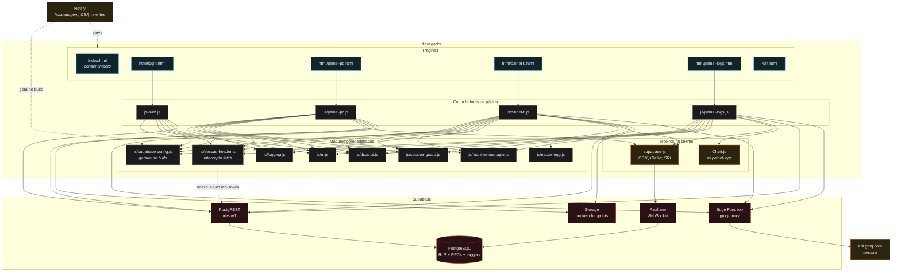
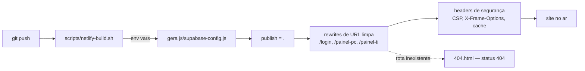

# 03 — Diagrama de componentes

**Fonte:** `js/README.md`, os `import` reais de cada módulo, `netlify.toml`,
`scripts/netlify-build.sh`, `supabase/functions/groq-proxy/index.ts`.

O DSos é **100% estático**: não há build step, bundler nem framework. Cada
página HTML carrega ES modules diretamente do navegador.



## Responsabilidade de cada módulo

| Módulo | Responsabilidade | Quem usa |
|---|---|---|
| `supabase-config.js` | URL + `anon key` + headers padrão. **Não versionado** — gerado por `scripts/netlify-build.sh` a partir de variáveis de ambiente | todos |
| `sessao-header.js` | Intercepta `window.fetch` e anexa `X-Sessao-Token` **só** para hosts `.supabase.co` | todos os controladores |
| `ui.js` | Tema, `toast`, `escapeHtml`, `statusLabel`, ícones por tipo | todos |
| `dsos-ui.js` | `dsosAlert` / `dsosConfirm` — substituem `alert`/`confirm` nativos | todos |
| `session-guard.js` | Logout por inatividade: aviso aos 28 min, logout aos 30 min | painel-pc, painel-ti, painel-logs |
| `logging.js` | Cliente de auditoria; monta o fingerprint do dispositivo | auth, painel-ti |
| `realtime-manager.js` | Handler padronizado de status de canal Realtime | painel-pc, painel-ti, painel-logs |
| `easter-egg.js` | Easter egg dos 5 cliques na logo — fonte única das 4 telas | todas as páginas |

## Interfaces com o backend

| Interface | Protocolo | Autorização |
|---|---|---|
| **PostgREST** `/rest/v1/<tabela>` | HTTPS REST | `anon key` + `X-Sessao-Token`; a RLS decide |
| **PostgREST** `/rest/v1/rpc/<funcao>` | HTTPS POST | `anon key`; as RPCs sensíveis revalidam o token internamente |
| **Realtime** WebSocket | `postgres_changes` na tabela `realtime_sinal` | só `anon key` — **o WebSocket não carrega header**, daí a tabela de sinal |
| **Storage** `/storage/v1/object/chat-prints/*` | HTTPS | `anon key` para upload; **leitura é pública** |
| **Edge Function** `/functions/v1/groq-proxy` | HTTPS POST | só `anon key` — não valida sessão |

## Três decisões de arquitetura que este diagrama torna visíveis

### 1. O interceptor de `fetch` existe porque o config é gerado no build

O lugar "óbvio" para o header seria o objeto de headers em
`supabase-config.js`. Não serve: o arquivo é **gerado na Netlify** a partir de
variáveis de ambiente (editar a cópia local não sobrevive ao deploy), e os
headers são montados no carregamento do módulo, quando o token **ainda não
existe** — o login ainda não aconteceu. Interceptar `fetch` resolve os dois
problemas de uma vez e cobre todos os pontos de saída sem repetir código.

### 2. A Edge Function é a única fronteira com um terceiro

`groq-proxy` existe por um motivo só: manter a `GROQ_KEY` fora do navegador.
Ela não consulta o banco. Em compensação, é por ali que **texto de chamado sai
da infraestrutura da escola** — o que a torna o ponto central da política de
privacidade, e não um detalhe de implementação.

Ela também **não valida sessão**: basta a `anon key` para consumir a cota
(lacuna L7 de [regras-de-acesso](../regras-de-acesso.md#l7--groq-proxy-não-valida-sessão)).

### 3. A CSP da Netlify é parte da arquitetura

`netlify.toml` define, para todas as rotas:

```
script-src  'self' 'unsafe-inline' https://cdn.jsdelivr.net https://unpkg.com
connect-src 'self' https://*.supabase.co https://api.groq.com wss://*.supabase.co
style-src   'self' 'unsafe-inline' https://fonts.googleapis.com
frame-ancestors 'none'
```

Consequência prática: **qualquer biblioteca nova precisa ou estar em
`js/vendor/` (servida do próprio domínio, coberta por `'self'`) ou ter o host
acrescentado à CSP.** Vendorizar é a opção preferida — evita depender de CDN em
tempo de execução e não afrouxa a política.

O `404.html` traz uma CSP própria, mais apertada (sem `unsafe-inline` em
scripts, sem CDN), porque não precisa de nada disso.

## Fluxo de deploy



A Edge Function **não** entra nesse deploy: ela é publicada à parte com
`supabase functions deploy groq-proxy`, seguindo o fluxo de
[WORKFLOW.md](../../WORKFLOW.md).
