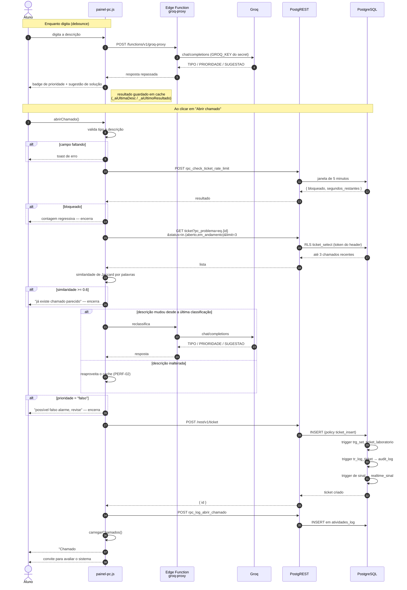

# 04 — Sequência: abrir chamado normal

**Fonte:** `js/painel-pc.js` (`abrirChamado`, `_verificarDuplicata`,
`classificarChamado`, `_checkTicketRateLimit`, `_atualizarBadgeAI`),
`supabase/functions/groq-proxy/index.ts`,
`rpc_check_ticket_rate_limit` e `rpc_log_abrir_chamado` no baseline.

Cenário: **aluno logado no próprio computador** descreve um problema e envia.

## O que importa neste fluxo

### A IA roda duas vezes — e uma delas é de graça

A classificação acontece **enquanto o usuário digita** (com *debounce*), para
mostrar o badge de prioridade e a sugestão de solução em tempo real. Se a
descrição não mudou entre o último badge e o clique em enviar, `abrirChamado`
**reaproveita o resultado em cache** em vez de chamar a Groq de novo. Antes da
correção PERF-02, isso dobrava custo e latência de IA em todo chamado aberto.

### A IA tem poder de veto

Se a classificação devolver `prioridade = "falso"`, o chamado **não é criado** —
o usuário recebe um aviso para revisar a descrição. O prompt define `falso`
como "tudo que não é claramente um problema de TI": xingamento, teste,
brincadeira, pedido de matéria escolar, problema físico da sala.

É uma decisão de produto com consequência real: **um chamado legítimo mal
descrito pode ser recusado por um modelo de linguagem.** Não há caminho de
apelação na tela — o usuário precisa reescrever. Vale registrar isso no TCC
como limitação conhecida, não como recurso.

Nos demais casos a IA não decide nada sozinha: `emergencia` vira
`prioridade = 'alto'` mais a marcação `chamado_emergencia`, e o tipo detectado
só é usado se o usuário não tiver escolhido um.

### A detecção de duplicado é local e barata

Não usa IA. É similaridade de Jaccard entre conjuntos de palavras com mais de
2 letras, contra os **3 chamados abertos mais recentes do mesmo PC**, com
limiar de 0,6. Chamados com a descrição `(chamado rápido)` são ignorados.

Limitação: como só olha o próprio PC e só chamados **abertos**, dois alunos
descrevendo o mesmo problema de rede em máquinas diferentes geram dois
chamados. É intencional — o alvo é o clique duplo, não a correlação de
incidentes.

### O rate limit não vale para emergência

`rpc_check_ticket_rate_limit` usa janela de 5 minutos por PC ou por login de
professor. Chamados de emergência **pulam a verificação** — a decisão é que o
risco de spam é menor que o de bloquear um pedido de socorro.

### Três coisas acontecem sozinhas no `INSERT`

O cliente não preenche `laboratorio`, não registra auditoria e não avisa
ninguém. Quem faz isso são os triggers: `trg_set_ticket_laboratorio` deriva o
laboratório do PC, `tr_log_ticket` grava em `audit_log`, e o trigger de sinal
grava em `realtime_sinal` — que é o que acende o painel do T.I.
(ver [06](06-seq-realtime.md)).

### O que este diagrama simplifica

* O upload de imagem não aparece: no fluxo de abertura não há anexo — imagens
  entram depois, pelo chat.
* O `logEvent` é *fail-safe*: se a RPC de log falhar, o erro é engolido com um
  `console.warn` e o chamado segue válido. Auditoria nunca derruba operação.
* A checagem de sessão do `DOMContentLoaded` fica fora — é pré-condição, não
  parte do fluxo.
