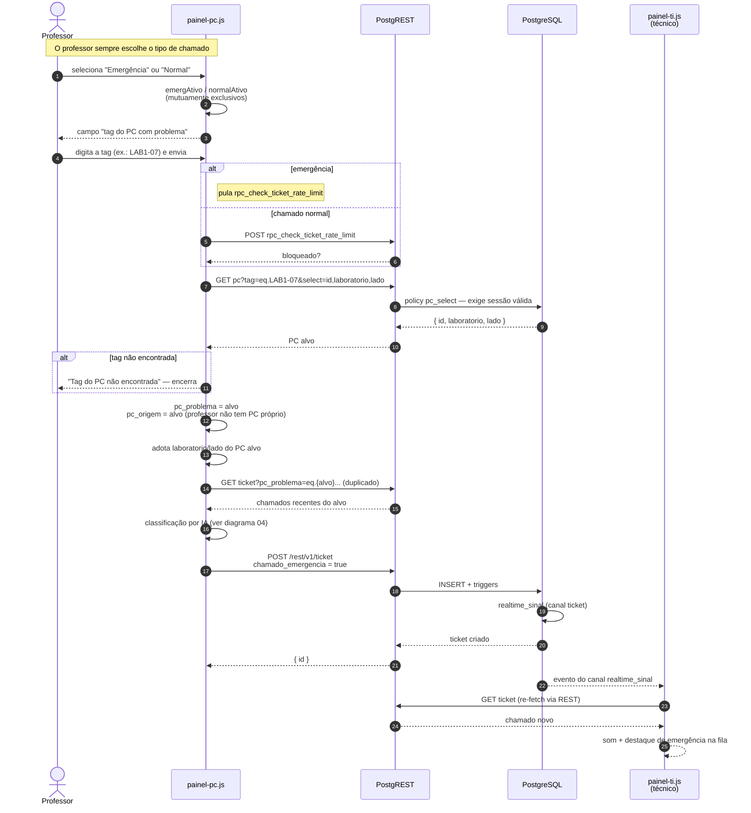
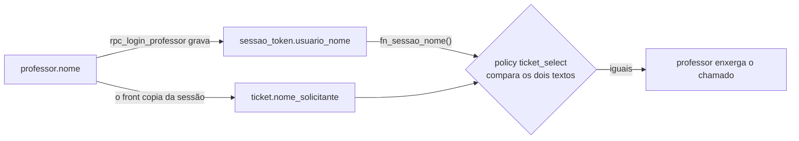

# 05 — Sequência: chamado de emergência

**Fonte:** `js/painel-pc.js` (`toggleEmerg`, `toggleNormal`,
`_resolverPcPorTag`, `abrirChamado`), `html/painel-pc.html`,
policy `pc_select` em `20260823170000_sec05b_fechar_leitura.sql`.

## O problema que a emergência resolve

O login do DSos é **do computador**, não da pessoa. Um aluno entra com a
credencial da máquina em que está sentado. Isso cria um beco sem saída: se o
computador não liga, não há como abrir chamado sobre ele.

A emergência é a saída — **abrir um chamado de um computador que funciona,
sobre outro que não funciona**, identificando o alvo pela tag física.

## Quatro diferenças em relação ao chamado normal

| | Chamado normal | Emergência |
|---|---|---|
| **Quem pode abrir** | aluno e professor | aluno (de outro PC) e professor |
| **`pc_origem` vs `pc_problema`** | iguais | diferentes — origem é a máquina usada, alvo é a que quebrou |
| **Rate limit** | aplica (5 min) | **pulado** |
| **`chamado_emergencia`** | `false` | `true` — destaca o chamado na fila do T.I. |

Há um segundo caminho para `chamado_emergencia = true`: **a IA classificar a
descrição como `emergencia`**, mesmo sem o usuário ter marcado nada. É o caso
de "está saindo fumaça do gabinete" — o prompt reserva essa prioridade para
risco físico real e imediato (fumaça, cheiro de queimado, choque, faísca,
alguém machucado). Nesse caso a prioridade gravada vira `alto` e a marcação de
emergência é ligada.

## O professor é o caso especial de verdade

Um professor **não tem PC próprio** no modelo de dados. Por isso, na tela dele:

* a escolha entre "Normal" e "Emergência" é **obrigatória** — sem ela, o envio
  é recusado;
* nos dois casos ele informa a tag do computador alvo;
* `pc_origem` e `pc_problema` recebem **o mesmo id — o do alvo**, já que não há
  outra máquina a atribuir;
* o `laboratorio` e o `lado` da sessão são adotados do PC alvo, e o rodapé da
  tela é atualizado para refletir isso.

> Antes do commit `fdb0a2d`, professor só conseguia abrir emergência. O
> chamado normal foi liberado depois — daí existirem dois botões quase iguais
> na tela.

## Como o professor volta a ver o chamado

`ticket` não tem `professor_id`. O vínculo é `nome_solicitante`, preenchido com
o nome da sessão, e a policy `ticket_select` casa esse texto com
`fn_sessao_nome()`.

Duas consequências que precisam estar no TCC:

1. **Um aluno que digite o nome de um professor cria um chamado que aquele
   professor passa a enxergar.** É comparação de texto, não de identidade.
2. **Trocar o nome do professor no cadastro o desliga dos chamados antigos.**
   O texto gravado em `nome_solicitante` não acompanha a mudança.

A correção é uma coluna `ticket.professor_id` com FK — item em aberto,
registrado como L5 em
[regras-de-acesso](../regras-de-acesso.md#l5--vínculo-professorchamado-é-por-nome-não-por-id).

## Por que `pc` não é fechado por dono

A policy `pc_select` exige apenas **sessão válida**, sem filtrar por
proprietário. É este fluxo que obriga: se um PC só pudesse ler o próprio
registro, `_resolverPcPorTag` não encontraria o alvo e a emergência deixaria de
funcionar. O painel-ti também depende disso para embutir `pc(tag, status_pc)`
nas listagens.

A troca é aceitável porque `pc` guarda inventário (tag, laboratório, lado,
status) e nenhum dado pessoal — a senha vive em `pc_senha`, fechada para todos.
