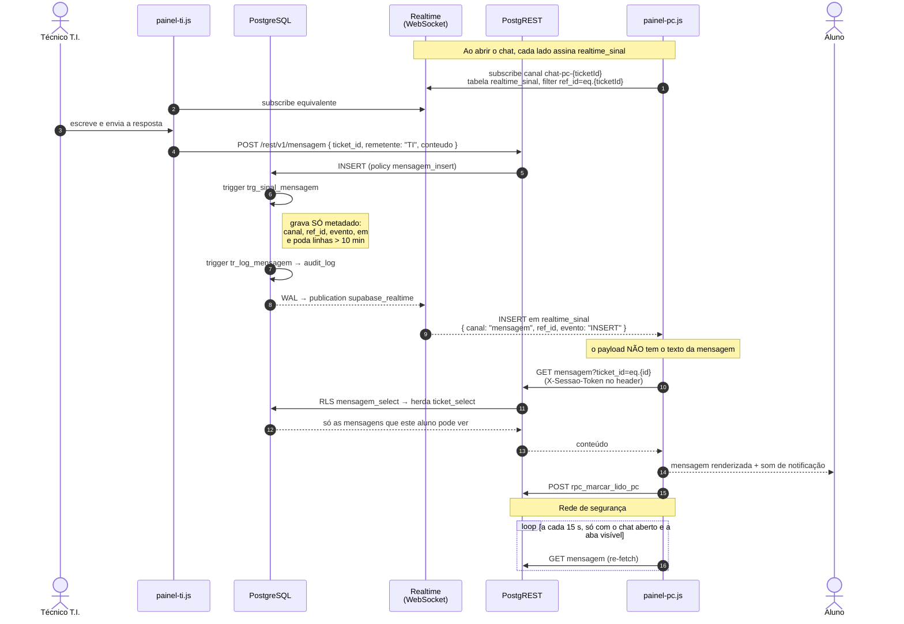
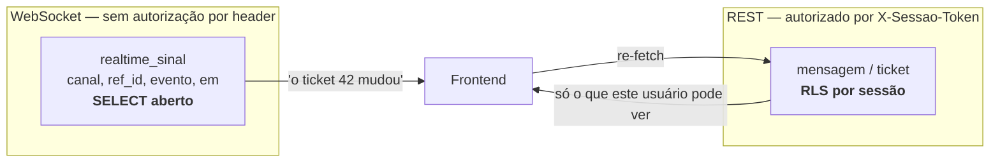

# 06 — Sequência: chat em tempo real

**Fonte:** `supabase/migrations/20260828120000_realtime_sinal_recupera_ao_vivo.sql`,
`supabase/migrations/20260823170000_sec05b_fechar_leitura.sql`,
`js/painel-pc.js` (`_iniciarRealtime`, `_iniciarPollChatPc`),
`js/painel-ti.js`, `docs/REALTIME.md`.

## Por que este diagrama existe

O caminho ingênuo — assinar `postgres_changes` na tabela `mensagem` — **parou
de funcionar** quando a leitura foi fechada, e o motivo é estrutural, não um
bug:

* A autorização do DSos viaja no header HTTP `X-Sessao-Token`.
* O Supabase Realtime avalia a RLS em `realtime.apply_rls()`, que seta apenas
  `role` e `request.jwt.claims`. **Nunca seta `request.headers`** — e não teria
  como: o header vai na requisição do PostgREST, o WebSocket não o carrega.
* Logo, `fn_sessao_tipo()` devolve `NULL` dentro do Realtime, as policies negam
  e nenhum evento é entregue. Sem erro visível: só silêncio.

A saída foi separar **o aviso** do **conteúdo**.

## A ideia central

**O dado sensível nunca trafega pelo WebSocket.** O que trafega é o aviso. O
conteúdo vem depois, pelo caminho que sabe quem está perguntando.

## Por que `realtime_sinal` pode ter `SELECT` aberto

Porque não há o que vazar: sem corpo de mensagem, sem nome de solicitante, sem
nota interna, sem status. Um anônimo de posse da `anon key` enxerga apenas
**ritmo de atividade e ids de ticket** — aceitável no modelo do projeto (um
banco por instituição, poucos usuários simultâneos).

Se um dia isso incomodar, `ref_id` pode virar hash sem mudar a estrutura nem o
frontend, que só o usa para filtrar.

> **Regra ao mexer nesta tabela:** nunca acrescentar coluna derivada de dado
> fechado por RLS. `tests/realtime-sinal.test.js` trava o formato justamente
> por isso — o bloco "sem token — o sinal não vaza conteúdo".

## Detalhes de implementação que valem registrar

### A tabela se poda sozinha

A mesma função de trigger que insere o sinal apaga as linhas com mais de 10
minutos. Sem `pg_cron`, sem job externo. O sinal só interessa por segundos — é
gatilho de re-fetch imediato — então 10 minutos já é folga larga, e a operação
é barata porque a tabela nunca cresce muito entre uma varrida e a seguinte.

### `ticket` e `mensagem` saíram da publicação

A migration remove as duas de `supabase_realtime`. Desde o SEC-05b o Realtime
não entregava mais eventos delas de qualquer forma; continuar publicando só
gastaria decodificação de WAL à toa e confundiria quem fosse diagnosticar.

### O poll virou rede de segurança, não mecanismo principal

| Antes do sinal | Depois |
|---|---|
| chat: poll a cada 5 s | poll a cada **15 s** |
| listas: poll a cada 30 s | mantido, como fallback |

O poll só roda com o modal aberto e para quando a aba vai para segundo plano
(`document.hidden`). Ele cobre queda de WebSocket, não operação normal.

### Uma função de trigger serve as duas tabelas

O canal chega por `TG_ARGV[0]`, então `fn_emitir_sinal_realtime` é registrada
duas vezes — `trg_sinal_ticket('ticket')` e `trg_sinal_mensagem('mensagem')` —
sem duplicar código. Para `mensagem`, o `ref_id` gravado é o `ticket_id`, não o
id da mensagem: é assim que o filtro `ref_id=eq.{ticketId}` do frontend
funciona para os dois canais.

### O painel-logs não foi afetado por nada disso

Os canais dele são das tabelas `*_log` e de `sessao_ativa`, que continuam com
`SELECT` aberto — e por isso continuam entregando eventos pelo caminho
tradicional. É também parte da lacuna L2 de
[regras-de-acesso](../regras-de-acesso.md#l2--tabelas-de-log-são-legíveis-por-qualquer-um):
o mesmo `USING (true)` que faz o realtime do painel-logs funcionar é o que
deixa os logs legíveis por qualquer um.
