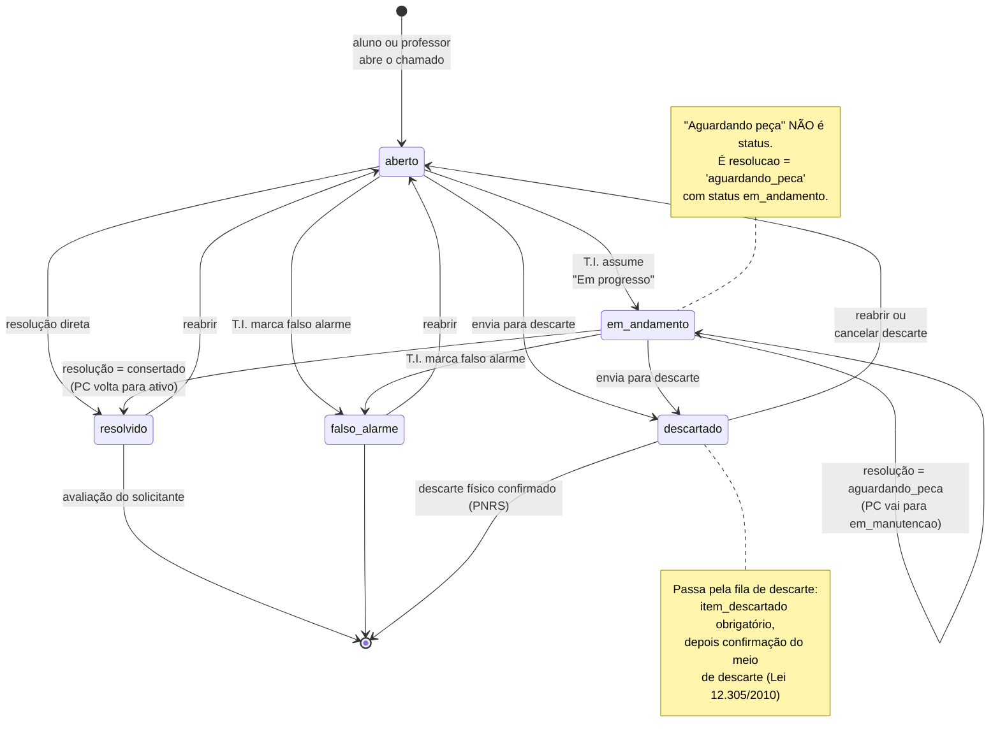
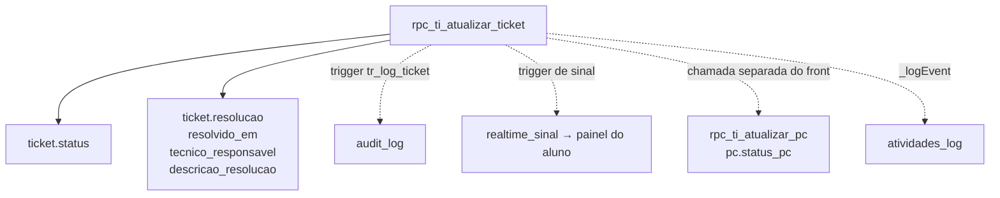
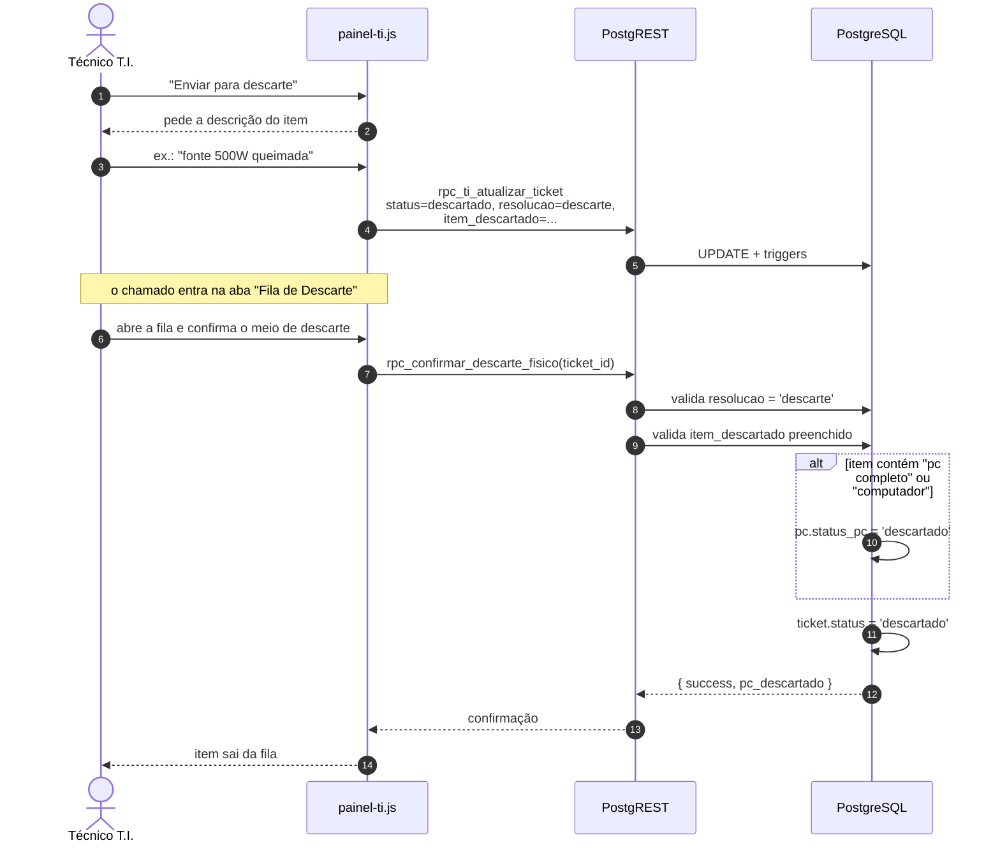

# 07 — Máquina de estados do chamado

**Fonte:** `js/painel-ti.js` (`setStatus`, `confirmarResolucao`,
`confirmarDescarte`, `reabrirTicket`, `cancelarItemDescarte`),
`js/ui.js` (`statusLabel`), `rpc_reabrir_ticket` e
`rpc_confirmar_descarte_fisico` no baseline, constraint
`ticket_resolucao_check`.

Todas as transições passam por `rpc_ti_atualizar_ticket` — que exige token de
sessão do tipo `ti` — ou por RPC dedicada. **Não existe transição de estado
disparada por aluno ou professor.**

## Os cinco estados

| `ticket_status` | Rótulo na tela | Significado |
|---|---|---|
| `aberto` | Aberto / ABERTO | criado, ninguém assumiu |
| `em_andamento` | Em andamento / EM PROGRESSO | técnico trabalhando (inclui "aguardando peça") |
| `resolvido` | Resolvido | problema consertado |
| `descartado` | Descartado | equipamento foi para descarte |
| `falso_alarme` | Falso alarme | não era problema de T.I. |

`js/ui.js` é a fonte única desses rótulos, com a variante `'caps'` para o
painel T.I. — antes cada painel reimplementava a tradução e as versões
divergiam em silêncio.

## Status × resolução: duas dimensões, não uma

O erro mais fácil de cometer neste modelo é tratar "aguardando peça" como
estado. Não é:

| `resolucao` | `status` resultante | `status_pc` resultante |
|---|---|---|
| `consertado` | `resolvido` | `ativo` |
| `aguardando_peca` | **`em_andamento`** | `em_manutencao` |
| `descarte` | `descartado` (após a fila) | `descartado`, se for PC completo |

Ou seja: **o chamado continua aberto enquanto a peça não chega** — o que é o
comportamento certo, já que o problema não foi resolvido. Existe uma referência
a `'aguardando_peca'` como se fosse status dentro de
`rpc_nao_lidas_por_ticket`; é código morto, nunca casa com nada.

## Efeitos colaterais de cada transição

Nenhuma mudança de status altera só o `ticket`:

Vale notar que a atualização do `pc.status_pc` é uma **segunda chamada feita
pelo frontend**, não parte da mesma transação. Se ela falhar depois de o
`ticket` já ter sido gravado, chamado e computador ficam momentaneamente
inconsistentes — o técnico vê o chamado resolvido e o PC ainda em manutenção.
Não é frequente nem grave (o próximo atendimento corrige), mas é uma
atomicidade que só uma RPC única resolveria.

## Reabertura

Três caminhos levam de volta a `aberto`:

| Origem | Ação | O que é limpo |
|---|---|---|
| `resolvido` | "Reabrir chamado" | `resolucao`, `resolvido_em`, `tecnico_responsavel`, `descricao_resolucao`; PC volta a `ativo` |
| `falso_alarme` | "Reabrir chamado" | idem |
| `descartado` | "Cancelar descarte" | idem **mais** `item_descartado`; PC volta a `ativo` |

Existe ainda `rpc_reabrir_ticket` no banco, que faz a mesma coisa em uma
transação e ainda força `prioridade = 'medio'`. O painel-ti **não a usa** —
prefere `rpc_ti_atualizar_ticket` com o patch explícito. A RPC continua sendo o
caminho mais seguro (é atômica e valida que o chamado está mesmo encerrado); a
divergência está registrada aqui para quem for uniformizar isso depois.

## A fila de descarte (PNRS)

O descarte é o único fluxo com **duas etapas obrigatórias**, porque envolve
conformidade legal:

`rpc_confirmar_descarte_fisico` recusa a confirmação se a resolução não for
`descarte` ou se `item_descartado` estiver vazio. É essa recusa que garante que
**nenhum equipamento sai do inventário sem registro do que foi descartado** —
o requisito de rastreabilidade da Lei 12.305/2010 (PNRS).

A heurística que decide se o computador inteiro sai do parque é textual:
`item_descartado` contendo "pc completo" ou "computador". Descartar "gabinete"
ou "máquina" **não** marca o PC como descartado. É frágil, e está aqui
documentado como tal.

## Avaliação — fora da máquina de estados

O solicitante avalia o atendimento de 1 a 5 estrelas via `rpc_avaliar_ticket`,
que:

* aceita token de **qualquer tipo** (quem avalia é o solicitante, e um T.I. que
  também é professor mantém o token de T.I.);
* exige que o chamado já esteja em `resolvido` ou `descartado`;
* recusa nota fora de 1..5 (validado também por `CHECK` na coluna).

A avaliação **não muda o status** — grava `avaliacao` e
`avaliacao_comentario`. Por isso aparece como saída do diagrama, e não como
transição.
